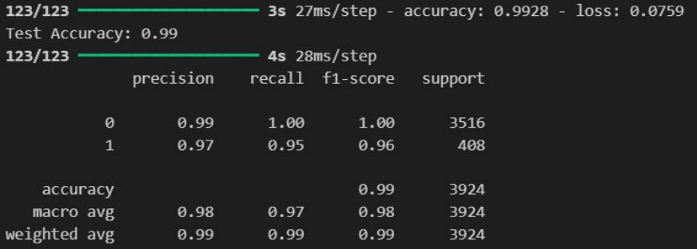

# PDF-Page-Classifier
PDF-Content-Page-Classifier is a sequential neural network model designed to accurately classify and index pages in PDF documents, including table of contents, table of figures, table of tables, references, and appendices. the Model works on Turkish Data.

## Dataset Overview
- the Model is trained on Turkish theses.

- **Total Pages:** 19,617
  - **Label-1 (Special Pages):** 2,139 pages
  - **Label-0 (Regular Pages):** 17,477 pages
- **Theses Included:** 135 theses, plus the first 20 pages of 38 theses
- **Data Format:** Provided in text format
- **Training Set:** 80% 
- **Test Set:** 20% 
  - **Validation Accuracy:** 99%
  - **F1 Score:**

    

## Notes

- **Common Errors:**
  - Many errors occur within pages containing figures or tables.
  - Occasionally, target pages are mistakenly labeled.
 
- **Performance Improvement:**
  - Adding more data improved performance.

